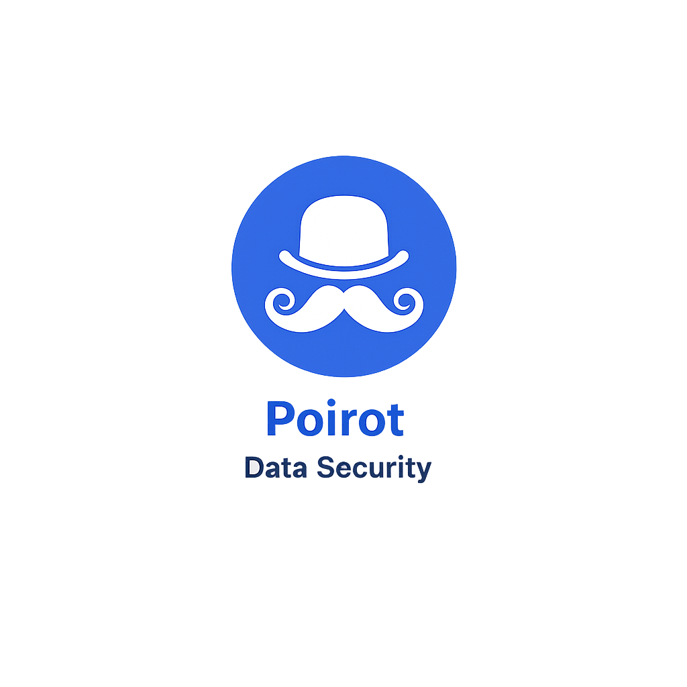
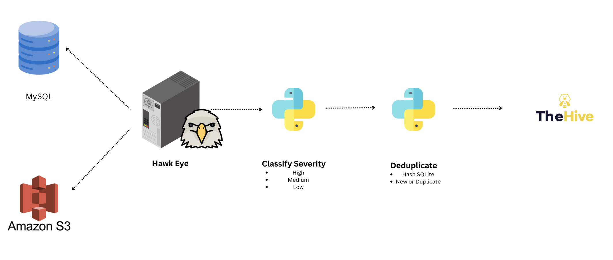

<p align="center">
  
</p>
<h1 align="center">Poirot DSPM</h1>
<div>
    <a href="https://www.loom.com/share/410cab64f9084212aff7911729f8896b">
    </a>
    <a href="https://www.loom.com/share/410cab64f9084212aff7911729f8896b">
      
    </a>
  </div>

<p align="center"><strong>Data Security Posture Management</strong> - Detecta, clasifica y gestiona datos sensibles en tus fuentes de datos.</p>

[](https://www.python.org/)
[](https://www.docker.com/)
[](https://nextjs.org/)
[](https://thehive-project.org/)
[](LICENSE)

> Blog: [La Batalla Perdida de la Clasificacion de la Informacion](https://blog.santiagoagustinfernandez.com/la-batalla-perdida-de-la-clasificacion-de-la-informacion)

---

## Que es Poirot?

Poirot escanea fuentes de datos buscando **informacion sensible** (tarjetas de credito, credenciales, PII) usando patrones regex configurables. Clasifica los hallazgos por severidad, deduplica por ubicacion y puede crear casos automaticamente en **TheHive** para su gestion.

El proyecto incluye una base de datos MySQL y un bucket S3 (via LocalStack) como **fuentes de prueba** para demostrar el funcionamiento.

### Pipeline



```
Fuentes de datos --> Hawk-Eye Scanner (regex) --> Clasificacion de severidad --> Deduplicacion (hash/SQLite) --> TheHive (casos)
```

### Que hace

- Escanea fuentes de datos con patrones regex configurables
- Clasifica hallazgos por severidad (CRITICAL, HIGH, MEDIUM, LOW)
- Deduplica por hash de ubicacion (misma tabla+columna+patron = 1 alerta)
- Detecta re-ocurrencias: si un hallazgo resuelto reaparece, se reabre
- Dashboard web con KPIs, graficos, filtros y exportacion
- CRUD de patrones y fuentes desde la UI
- Creacion automatica de casos en TheHive
- Notificaciones por SMTP, Slack, Teams o Webhook

---

## Stack

| Componente | Tecnologia | Puerto |
|---|---|---|
| Scanner | Python 3.11 + [hawk_scanner](https://github.com/rohitcoder/hawk-eye) | - |
| Dashboard | Next.js + shadcn/ui + Tailwind | `:8080` |
| API | Flask | Interno |
| Case Management | TheHive 5.0 (opcional) | `:9000` |
| Tracking | SQLite | - |
| *Demo:* Base de datos | MySQL 8.0 | `:3306` |
| *Demo:* Object Storage | LocalStack S3 | `:4566` |

---

## Instalacion

### Prerrequisitos

- Docker Engine 20.10+
- Docker Compose 2.0+
- Python 3.11+ (para generar datos de prueba)

### Modo Standalone (sin TheHive)

```bash
git clone https://github.com/safernandez666/poirot.git
cd poirot

# Levantar servicios
docker compose up -d

# Generar datos de prueba en MySQL y S3
pip3 install pymysql boto3
python3 generar_datos.py

# Ejecutar el primer scan
docker exec hawk-scanner python3 run_hawk_scanner.py
```

Dashboard: **http://localhost:8080**

### Modo con TheHive

Incluye Cassandra + Elasticsearch + TheHive para gestion de casos:

```bash
# Habilitar TheHive en docker-compose.yml:
#   THEHIVE_ENABLED=true (en hawk-scanner y dashboard)

# Levantar con el perfil thehive
docker compose --profile thehive up -d

# Generar datos y escanear
pip3 install pymysql boto3
python3 generar_datos.py
docker exec hawk-scanner python3 run_hawk_scanner.py
```

Dashboard: **http://localhost:8080** | TheHive: **http://localhost:9000**

#### Configurar API Key de TheHive

TheHive necesita una API key para que el scanner cree casos. Despues de que TheHive este healthy:

1. Entrar a http://localhost:9000 (user: `admin@thehive.local` / pass: `secret`)
2. Crear organizacion "poirot"
3. Crear usuario `poirot@thehive.local` con perfil **org-admin**
4. Generar API Key para ese usuario
5. Actualizar la key en `docker-compose.yml` (`THEHIVE_API_KEY`)
6. `docker compose build hawk-scanner dashboard && docker compose up -d`

Verificar conexion:
```bash
curl -s http://localhost:8080/api/thehive/status
# {"status":"connected","code":200}
```

---

## Dashboard

El dashboard tiene 7 secciones:

| Pagina | Descripcion |
|---|---|
| **Dashboard** | KPIs, graficos de severidad y fuentes, alertas recientes, boton "Escanear Ahora" |
| **Alertas** | Tabla con filtros por severidad/estado, busqueda, exportacion CSV/JSON |
| **Patrones** | CRUD de patrones regex, visualizador y validador de regex |
| **Timeline** | Grafico de detecciones por dia |
| **Fuentes** | CRUD de fuentes de datos, semaforo de conectividad |
| **Casos** | Casos en TheHive, sincronizacion de alertas |
| **Configuracion** | Canales de notificacion (SMTP, Slack, Teams, Webhook, TheHive) |

---

## Patrones

Los patrones se definen en `hawk-scanner/fingerprint.yml` o desde la UI:

```yaml
Credit Card - Visa: \b4[0-9]{12}(?:[0-9]{3})?\b
Social Security Number (SSN): \b\d{3}-\d{2}-\d{4}\b
AWS Access Key: \b(AKIA|A3T|AGPA|AIDA|AROA|AIPA|ANPA|ANVA|ASIA)[A-Z0-9]{16}\b
Private Key: '-----BEGIN (RSA|DSA|EC|OPENSSH|PGP) PRIVATE KEY-----'
```

Patrones incluidos:

| Categoria | Patrones | Severidad |
|---|---|---|
| **Tarjetas** | Visa, Mastercard, Amex, Discover | CRITICAL |
| **Credenciales** | AWS Secret Key, Private Keys | CRITICAL |
| **PII/Acceso** | SSN, AWS Access Key, Passwords, API Keys, JWT, URLs con credenciales | HIGH |
| **Contacto** | Email, Telefono US/Internacional, IP Privada, IBAN | MEDIUM |
| **Crypto** | Bitcoin Address | LOW |

---

## API

| Endpoint | Metodo | Descripcion |
|---|---|---|
| `/api/health` | GET | Health check |
| `/api/stats` | GET | KPIs del dashboard |
| `/api/alerts` | GET | Alertas con filtros (`severity`, `status`, `source`) |
| `/api/alerts/export` | GET | Exportar alertas (`format=csv\|json`) |
| `/api/config/patterns` | GET/POST | Listar/agregar patrones |
| `/api/config/patterns/<name>` | PUT/DELETE | Editar/eliminar patron |
| `/api/config/sources` | GET/POST | Listar/agregar fuentes |
| `/api/config/sources/<type>/<name>` | DELETE | Eliminar fuente |
| `/api/config/sources/health` | GET | Conectividad de cada fuente |
| `/api/config/notifications` | GET | Canales de notificacion |
| `/api/config/notifications/<channel>` | PUT | Actualizar canal |
| `/api/config/notifications/<channel>/test` | POST | Enviar notificacion de prueba |
| `/api/validate-regex` | POST | Validar regex contra texto |
| `/api/scanner/run` | POST | Ejecutar scan |
| `/api/scanner/status` | GET | Estado del scan |
| `/api/thehive/status` | GET | Conexion con TheHive |
| `/api/thehive/cases` | GET | Listar casos |
| `/api/thehive/sync` | POST | Sincronizar alertas pendientes |

---

## Desarrollo Local

Para iterar en el dashboard sin rebuild de Docker:

```bash
# Terminal 1: API Flask
pip3 install flask flask-cors pyyaml requests
python3 dashboard/dev.py

# Terminal 2: Frontend Next.js
cd dashboard/frontend-next
npm install
npm run dev
```

API en http://localhost:5001 | Frontend en http://localhost:3000

---

## Estructura

```
.
├── docker-compose.yml              # Orquestacion
├── Dockerfile                      # Scanner image
├── generar_datos.py                # Generador de datos de prueba
│
├── hawk-scanner/                   # Motor de escaneo
│   ├── run_hawk_scanner.py         # Script principal
│   ├── alert_manager.py            # Tracking y deduplicacion (SQLite)
│   ├── severity_classifier.py      # Clasificacion por tipo de dato
│   ├── notification_manager.py     # SMTP, Slack, Teams, Webhook, TheHive
│   ├── fingerprint.yml             # Patrones regex
│   └── connection.yml              # Fuentes + config notificaciones
│
├── dashboard/                      # Dashboard web
│   ├── Dockerfile                  # Multi-stage: Next.js build + Nginx + Flask
│   ├── api/
│   │   └── api.py                  # API REST Flask
│   └── frontend-next/              # Next.js + shadcn/ui
│       └── src/app/                # Pages: dashboard, alertas, patrones, etc.
│
├── reset.sh                        # Limpia alertas DB (preserva casos TheHive)
└── thehive-config/
    └── application.conf
```

---

## Disclaimer

Este proyecto es para **fines educativos y de investigacion en seguridad**. Las fuentes de datos incluidas (MySQL y S3) contienen datos completamente ficticios y existen solo para demostrar el funcionamiento del scanner.

---

## Licencia

[MIT License](LICENSE)

---

**Santiago Fernandez** - [Blog](https://blog.santiagoagustinfernandez.com) | [GitHub](https://github.com/safernandez666) | [LinkedIn](https://linkedin.com/in/safernandez666)
